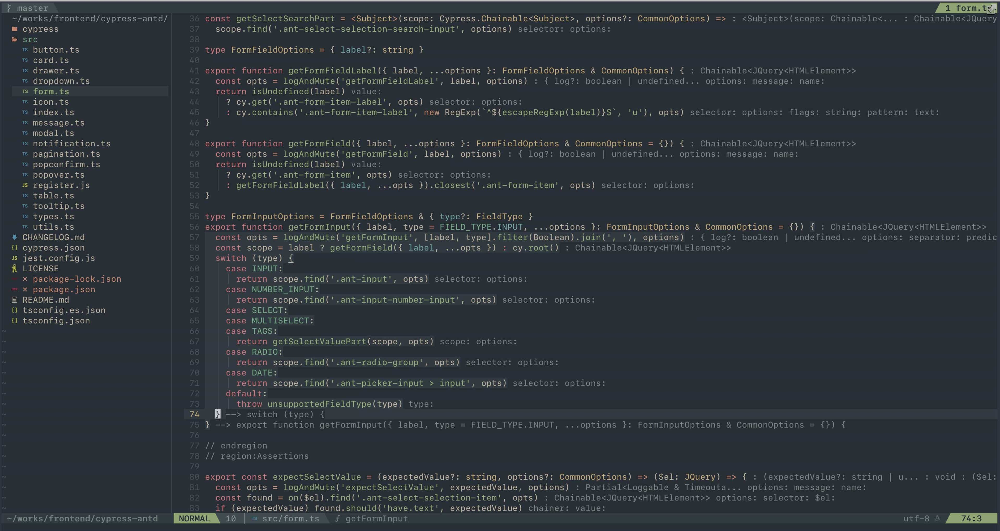
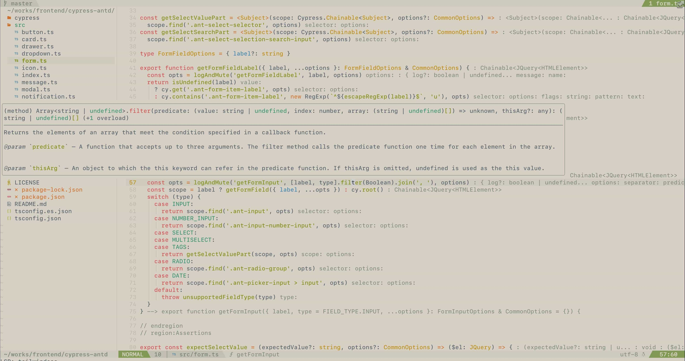

# Neovim Nightforest

A colorscheme for Neovim 0.7+ reimplemented in lua from [nightforest](https://github.com/xfyuan/nightforest.nvim).

## Screenshots

Nightforest


Dawnforest



Dayforest



## Commands

To apply the colorscheme, you can call `require('nightforest').colorscheme()` from lua or use `:colorscheme nightforest` command. By default it respects your `'background'` (see `:h background`) setting to choose between `dark` and `light` variants. But you can use the `:colorscheme nightforest`, `:colorscheme dayforest`, or `:colorscheme dawnforest` commands to apply a variant directly.

## Configuration

To configure the plugin, you can call `require('nightforest').setup(values)`, where `values` is a dictionary with the parameters you want to override. Here are the defaults:

```lua
require('nightforest').setup({
    midnight = false, -- Set to `true` to use `midnight` variant to render a deep dark background.
    overrides = {}, -- A dictionary of group names, each associated with a dictionary of parameters (`bg`, `fg`, `sp` and `style`) and colors in hex.
})
```

Alternatively, `overrides` can be a function that returns a dictionary of the same format. You can use the function to override based on a dynamic condition, such as the value of `'background'`.

Colorscheme also provides a theme for [lualine.nvim](https://github.com/nvim-lualine/lualine.nvim). You can set in `setup` lualine:

```lua
require('lualine').setup({
  options = {
    theme = 'nightforest',
  },
})
```

### `overrides` Examples

1. Replace `IncSearch` group with foreground set to `#FFFFFF`:

```lua
require('nightforest').setup({
  overrides = {
    IncSearch = { fg = '#FFFFFF' }
  }
})
```

2. Change the background color of non-active windows to make the active one more obvious, specifying overrides for both light and dark backgrounds:

```lua
require 'nightforest'.setup({
  overrides = function()
    if vim.o.background == 'dark' then
      return { NormalNC = {bg = '#0f151e', fg = '#808080'} }
    else
      return { NormalNC = {bg = '#f0f0f0', fg = '#808080'} }
    end
  end
})

```

**Tip:** You can use `:source $VIMRUNTIME/syntax/hitest.vim` to see all highlighting groups.

3. To get the colors from the colorscheme you can use `nightforest.colors`:

```lua
local colors = require('nightforest.colors')
colors.generate() -- Pass `true` to enable midnight

require('nightforest').setup({
  overrides = {
    IncSearch = { fg = colors.fg }
  }
})
```

**Tip:** You can use `:lua print(vim.inspect(require('nightforest.colors')))` command to check all available colors.

### Inspiration

The following themes were used as an inspiration:

- [Ayu theme for Neovim](https://github.com/Shatur/neovim-ayu) - The code structure from this theme
- [sainnhe/everforest](https://github.com/sainnhe/everforest) - The color palette from this theme
